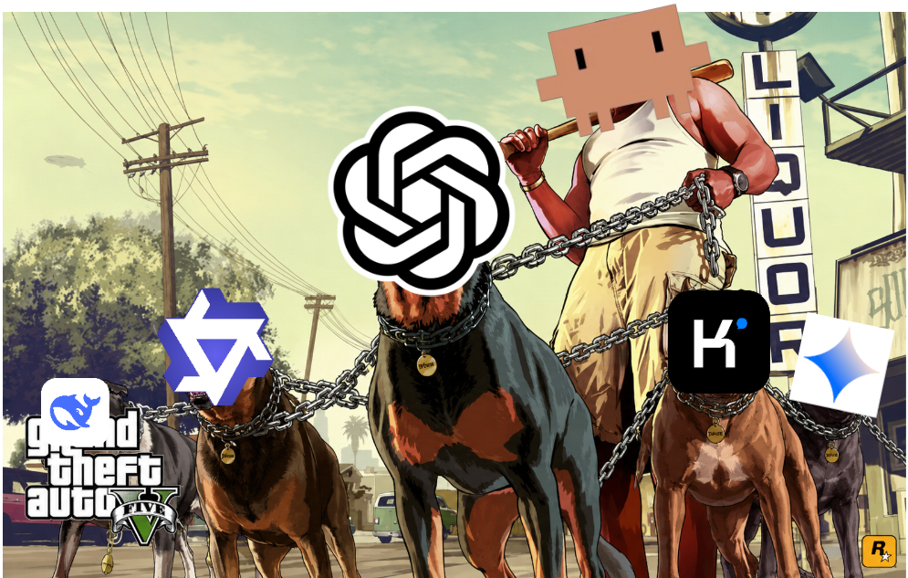
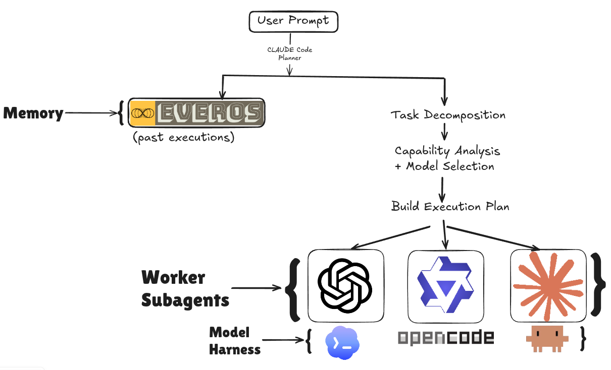

# agentplan



A local-first delegation layer for coding agents. Claude Code stays the planner, and mechanical subtasks get handed to cheaper models running as separate OS processes on your machine. Built for the Snowflake x Beta Fund x EverMind Agent & Token Economy Hackathon (Track 1: cost reduction).

## What it does

- Registers a machine-wide `delegate` MCP tool that Claude Code can call from any project
- Claude Code decomposes work and hands bounded, self-contained subtasks to the cheapest model that can actually do them
- Workers run read-only in the current directory on real coding CLIs (`codex exec`, `opencode run`) and return findings as text
- A live Ink TUI dashboard shows the model roster, in-flight delegations, and cost savings versus an all-frontier baseline
- An EverOS memory hook enriches every Claude Code prompt with relevant prior orchestration experience

## Architecture



- **Planner**: Claude Code reads the real repo, decomposes the goal, and picks a model per task. Allocation is a planning decision, not a runtime router
- **Memory**: EverOS retrieves past agent cases and skills on every prompt. Setup guide in [docs/everos-setup.md](docs/everos-setup.md)
- **Workers**: peer OS processes, each harness authenticates itself. The app holds no provider keys

## Model roster

| Tier | Harness | Backend |
|---|---|---|
| Frontier | `claude -p` | Anthropic (the only harness returning exact `total_cost_usd`) |
| Mid | `codex exec` | OpenAI via ChatGPT OAuth |
| Local | `opencode run` | vLLM serving Qwen3-4B on `127.0.0.1:8000` |

## Usage

```bash
pnpm install

# see what install would change, without doing it
pnpm --filter @agentplan/cli dev install-preview

# register the MCP server + hook globally
pnpm --filter @agentplan/cli dev install

# open the dashboard (MODELS + LIVE)
pnpm --filter @agentplan/cli dev
```

Then use Claude Code anywhere. When a subtask is mechanical, wide, or well-specified, it calls `delegate` and the work runs on a cheaper model while the dashboard tracks it live.

## Cost honesty

- Only Claude Code returns real dollars. Codex and local costs are estimated equivalents, labelled as such everywhere
- Unknown cost renders as "tokens only", never `$0.00`
- The savings baseline holds token counts constant across models, and that assumption is printed next to the number

## Storage

Everything lives under `~/.agentplan/`, never in your repo. Per-run telemetry is written as flat NDJSON (`tasks.jsonl`), ready for direct Snowflake ingestion via `COPY INTO`.

## Stack

Node 22 + TypeScript (strict, ESM, no build step via `tsx`), Ink 6 + React 19 for the TUI, Zod 4 for schemas, pnpm workspaces. No database, no HTTP server, no bundler.

Full design in [PLAN.md](PLAN.md).
